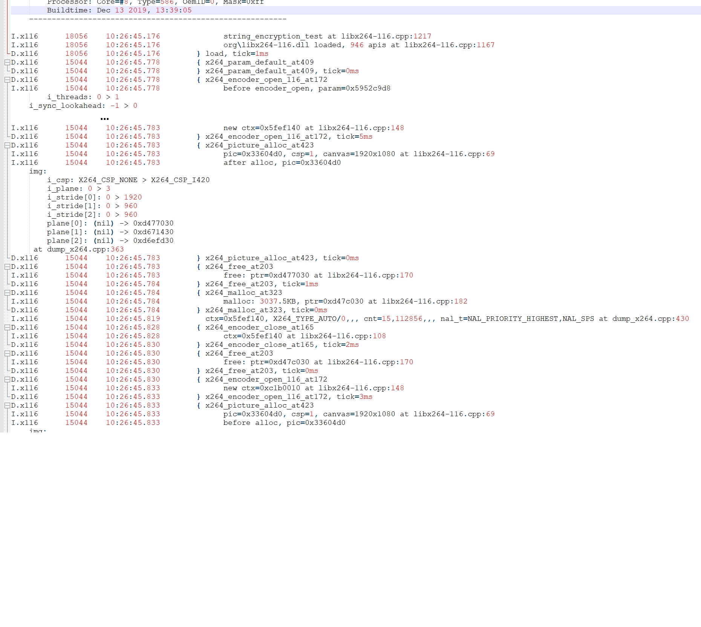

# Log reformatter
 생성된 로그를 파싱해서 각 쓰레드의 콜스택에 따라 들여쓰기 해주는 유틸 스크립트.
 - 로그포멧
    - D.x116      15044    10:26:45.778   { x264_param_default_at409
    - 레벨.tag    tid       time           log body.
    - 로그의 scope는 **{** 로 시작해서 **}** 로 끝납니다.

[원본 이미지]


[파싱 후 이미지]
- scope 별 실행 시간이 붙음
-   } x264_encoder_open_116_at172, **tick=5ms**



- 로그 마지막에 각 함수별 호출 횟수및 평균 실행 시간 계산함.


# python v3 code

```py
#!/usr/bin/env python
# -*- coding: UTF-8 -*-

#
# log-indent version2 with Utils/log
#
import re
import sys
import os
import glob
import boilerplate


# D.test      3312     15:40:08.887 { test_proc1(to=15000ms)
@boilerplate.static_var("logSyntax", re.compile(r'\s*'.join((
        r'\s*'.join((
                r'([VDIWE]\.(\w+)?',  # level.tag?
                r'(\d+)',  # thread
                r'([^\s]+))'  # time
        )),
        r'([{}\s]*)',  # scope level
        r'([^\n]+)'  # messages
))))
def parse_log_line(line):
    m = parse_log_line.logSyntax.match(line)
    if not m:
        # print('?' + line, end="")
        return None

    hdr = m.group(1)  # 2:tag, 3:tid, 4:tick
    tag = m.group(2)
    tid = int(m.group(3))
    tick = m.group(4)
    scope = m.group(5)
    msg = m.group(6)
    return hdr, tag, tid, tick, scope, msg


def timeToms(t0):
    from datetime import datetime
    try:
        t1 = datetime.strptime(t0, '%H:%M:%S.%f')  # 16:25:18.843
        tbase = datetime.strptime('00:00:00', '%H:%M:%S')
        return (t1 - tbase).total_seconds() * 1000.0
    except ValueError as e:
        print('Invalid time:', t0, str(e))
    return 0


def indent_log_file(fin, out_path, roi_tid):
    # print '* Start indentation for', path, 'Filter=',theTid
    tmp_stdout = sys.stdout
    if out_path:
        sys.stdout = open(out_path, "wt")
        # print('* Start indentation for', in_path, 'Filter=', roi_tid, 'LogVersion=1')

    fmt_out = '%s %+*s %s'
    calls = {}
    ticks = {}  # func: total times, called count.
    while fin:
        line = fin.readline()
        if not line:
            break

        # print line
        m = parse_log_line(line)
        if not m:
            import base91
            base91str = base91.get_base91str(line)
            if base91str: line = line.replace(base91str, base91.decode(base91str))
            print('    ' + line, end="")
            continue

        (hdr, tag, tid, tick, scope, msg) = m

        # print('%s [%s] %s' % (hdr, scope, msg)); continue

        def msToStr(ms):
            if ms >= 1000:
                return "%.2fsec" % (ms / 1000.0)
            return "%.fms" % ms

        # build index with pid,tid.
        index = tid
        if index not in calls:
            calls[index] = []

        if scope and scope[0] == '{':
            prefix = len(calls[index]) * 4 + 8
            if not roi_tid or index == roi_tid:
                print(fmt_out % (hdr, prefix, '{', msg))  # hdr, scope, msg
            # add call depth.
            calls[index].append(timeToms(tick))

        elif scope and scope[0] == '}':
            elapsed0 = 0  # remove call depth.
            prefix = 8
            try:
                elapsed0 = timeToms(tick) - calls[index].pop()  # remove call depth.
                prefix = len(calls[index]) * 4 + 8
            except IndexError:
                pass

            if not roi_tid or index == roi_tid:
                print(fmt_out % (hdr, prefix, '}', msg), end='')  # hdr, scope, msg
                print(', tick={0}'.format(msToStr(elapsed0)))
                if elapsed0 > 0:
                    funcName = msg
                    if not funcName in ticks: ticks[funcName] = [0, 0, 0]
                    ticks[funcName][0] += 1  # called count
                    ticks[funcName][1] += elapsed0  # total
                    ticks[funcName][2] = ticks[funcName][1] / ticks[funcName][0]  # average
        else:
            if not roi_tid or index == roi_tid:
                prefix = len(calls[index]) * 4 + 8
                print(fmt_out % (hdr, prefix, '', msg))

    # not closed calls
    print("\n\n")
    for index, called in calls.items():
        if len(called) > 0:
            print("E.%d:%-15d Call stack is not closed: call depth=%d" % (index >> 16, index & 0xffff, len(called)))

    # sort ticks..
    print("\n\n")
    print("%-45s: %s/%s, %s" % ("function", 'ave', 'total', 'called'))
    sorted_x = sorted(ticks.items(), key=lambda ticks: ticks[1][2], reverse=True)
    for i in sorted_x:
        # print(i)
        func = i[0]
        ave_tick = msToStr(i[1][2])
        total_tick = msToStr(i[1][1])
        called = i[1][0]
        print("%-45s: %s/%s, %d" % (func, ave_tick, total_tick, called))
    # for func, tinfo in ticks.items():
    #     called = tinfo[0]
    #     print('{0}, called={1}, time={2}/{3}'.format(func, called, msToStr(tinfo[2]), msToStr(tinfo[1])))

    sys.stdout = tmp_stdout
    return


def indent_log_path(in_path, out_path, roi_tid):
    try:
        indent_log_file(open(in_path, "rt"), out_path, roi_tid)
        return
    except IOError:
        print("Can't open", in_path)
        return


def open_file(file_path):
    import subprocess
    import platform
    if platform.system() == 'Darwin':  # macOS
        subprocess.call(('open', file_path))
    elif platform.system() == 'Windows':  # MSWindows
        os.startfile(file_path)
    else:  # linux variants
        subprocess.call(('xdg-open', file_path))
    pass


def indent_logs_from_zip(zip_path, roi_tid):
    import zipfile
    import io
    converted_files = []
    basedir = os.path.dirname(zip_path)
    zfile = zipfile.ZipFile(zip_path)
    for zentry in zfile.infolist():
        # print(zentry)
        if not zentry.filename.endswith(".log"):
            continue

        out_path = os.path.join(basedir, os.path.basename(zentry.filename).replace('.log', '.indented')
                                + (".tid%d.log" % roi_tid if roi_tid else ".log"))
        # https://stackoverflow.com/questions/5627954/how-do-you-read-a-file-inside-a-zip-file-as-text-not-bytes
        fin = io.TextIOWrapper(zfile.open(zentry), encoding='iso-8859-1')
        indent_log_file(fin, out_path, roi_tid)
        converted_files.append(out_path)
        print("Output file", out_path)
    return converted_files


def main():
    import argparse
    import os.path
    # for f in sys.argv[1:]: print('=',f)

    def exit_on_err(msg):
        print(msg)
        print("\nHit enter to exit...")
        input()
        sys.exit(-1)
        return

    parser = argparse.ArgumentParser()
    parser.add_argument("-t", "--tid", type=int, help="set the tid which you want")
    parser.add_argument("-c", "--convert", action='store_true',
                        help="Convert only. Do not Open output file with default app.")
    parser.add_argument('logfile', nargs='*')
    # print("Usage:\n\tpy {--tid=n} logfile\n")

    args, unknown = parser.parse_known_args()
    if unknown:
        print("Unknown =", unknown)

    # if this script in /TestWS/Scripts/ folder, IE, developing stage.
    if "/TestWS/Scripts/" in __file__ and len(args.logfile) == 0:
        args.logfile.append(r'EngineManager.exe-20191119.100939-S1.objects-P18096.SYSTEM.log')  # test
        args.logfile.append(r'D:\TestWS\Scripts\TestUtils.exe-20191011.154008-S1.objects-P9680.objects.log')

    if len(sys.argv) <= 1 and len(args.logfile) == 0:
        exit_on_err(parser.format_help())

    # print(args.logfile)
    sources = []
    for in_path in args.logfile:
        if os.path.isdir(in_path):
            sources.extend(glob.glob(os.path.join(in_path, "*.log")))
            sources.extend(glob.glob(os.path.join(in_path, "*.zip")))
        elif os.path.exists(in_path) and (in_path.endswith(".log") or in_path.endswith(".zip")):
            sources.append(in_path)

    for src_file in sources:
        # xxx.cpp for syntax highlighting.
        # print("Indent for", log_path)
        if src_file.endswith('.zip'):
            converted = indent_logs_from_zip(src_file, args.tid)
            if not args.convert:
                for i in converted:
                    open_file(i)
        else:
            if ".indented." in src_file:
                continue

            out_path = src_file.replace('.log', '.indented') + (".tid%d.log" % args.tid if args.tid else ".log")
            indent_log_path(src_file, out_path, args.tid)
            print("Output file", out_path)
            if not args.convert:
                open_file(out_path)
    return


if __name__ == '__main__':
    main()
    pass


```

```py 
#!/usr/bin/env python
# -*- coding: UTF-8 -*-
#
# boilerplate.py

import os

def static_var(var_name, value):
    def decorate(func):
        setattr(func, var_name, value)
        return func
    return decorate


def srcpos():
    from inspect import currentframe, getframeinfo
    frameinfo = getframeinfo(currentframe().f_back)
    return 'at File "{}", line {}'.format(os.path.basename(frameinfo.filename), frameinfo.lineno)

```